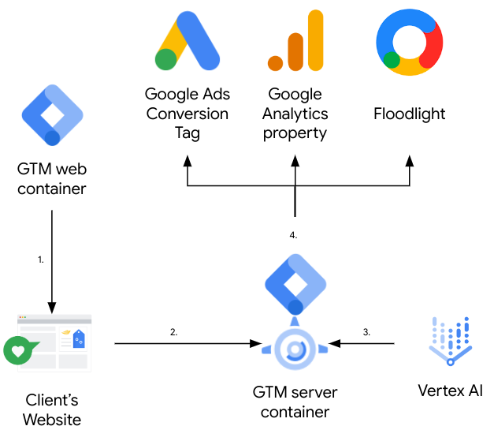
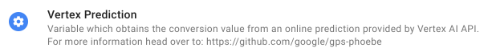
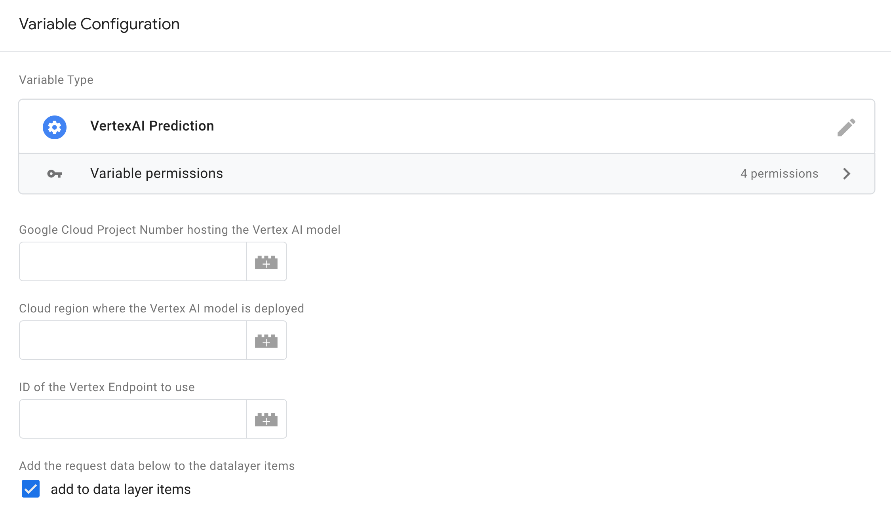
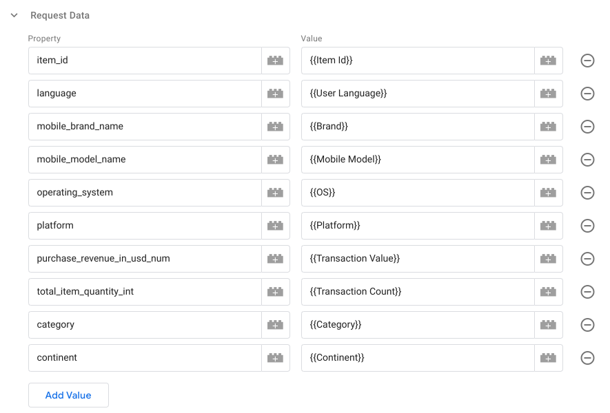
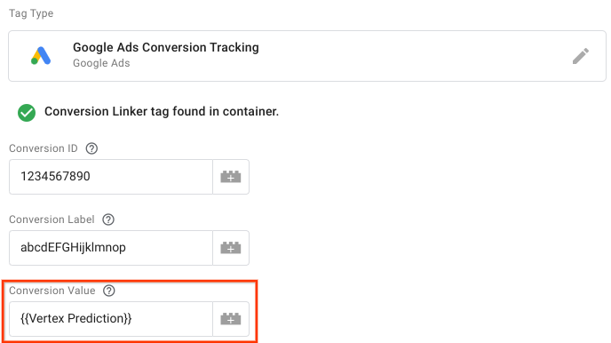

# gPS Phoebe

*Real-time AI-based value based bidding with Google Ads products, that keeps
sensitive data away from determined end users.*

Use
[Server Side Tag Manager](https://developers.google.com/tag-platform/tag-manager/server-side)
with [Vertex AI](https://cloud.google.com/vertex-ai), to generate real time
predictions based on ML models, and use them with Google Ads products and other
services to improve your targeting and bidding processes.

## Description

With server-side Tag Manager we are able to bid to a secret conversion value by
leveraging the built-in Firestore lookup (see
[gPS Soteria](https://github.com/google/gps_soteria)). One of the limitations
with this approach is that the conversion value needs to sit in Firestore before
the conversion happens. This prevents more advanced bidding use-cases that use
AI to determine this value.

gPS Phoebe allows users to leverage server-side Tag Manager to get predictions
directly from a Vertex AI model in real time, and use the predicted values as
secret conversion values to be used in value based bidding.

The image below provides a high level overview of the core components involved,
and outlines the flow.



1.  A GTM web container is used to set up tagging on the site, and is configured
    with a “purchase” event.
2.  The client’s website is set up to have an e-commerce purchase event in the
    data layer: this contains the revenue data. When a purchase is made, the
    event fires, sending the payload to a GTM server container.
3.  A custom variable is attached to a tag, triggered by “purchase” events,
    which queries the Vertex AI to get a prediction based on the provided data,
    and replaces the revenue conversion value with the predicted value. This
    request passes through a proxy app to enable unauthenticated calls to the
    Vertex AI endpoint.
4.  The updated event (with the predicted conversion value) is sent to Google
    Analytics, Google Ads or Floodlight.

## Demo Implementation

If you are interested in deploying an entire demo environment to test the
solution, along with a demo web store and sample tags in GTM, you can follow the
guide [here](demo/DEMO.md). Otherwise, skip to the next section for the
implementation guide.

## Implementation Guide

### Requirements

*   A Google Cloud project with billing enabled
*   A GTM server container up and running, and receiving events from a GTM web
    container
*   A Vertex AI endpoint with the model you want to us
*   It is recommended to have all the components in the same cloud region to
    reduce network latency

### Prepare the environment

Clone the repository to a local folder in your current environment (we recommend
using cloud shell for the deployment as it provides all required utilities out
of the box), using this command:

```sh
git clone https://github.com/google/gps-phoebe
```

If you are not using cloud shell, you must install the
[gcloud CLI](https://cloud.google.com/sdk/docs/install) in your environment.

### Deploy the proxy application

You need to use a proxy application to call a Vertex AI endpoint, as currently
server-side Tag Manager does not support outbound authenticated requests.

There are two deployment options: App Engine and Cloud Run. The functionality of
both is identical, but Cloud Run provides a bit more flexibility as you can
deploy it in the same project along with other applications running on Cloud
Run.

Before proceeding, you need to select the project the Google Cloud project with
the following command (substitute PROJECT_ID with the correct project id):

```sh
gcloud config set project PROJECT_ID
```

#### Cloud Run

Execute the following command to deploy the proxy application to Cloud Run:

```sh
cd proxy_app/app_engine
gcloud app init
gcloud app deploy
```

#### App Engine

Execute the following command to deploy the proxy application to App Engine:

```sh
cd proxy_app/cloud_run
gcloud run deploy phoebe-proxy-app --source proxy_app/cloud_run
```

### Configure Tag Manager

#### Import the template

Download the template file [here](gtm/variable_template.tpl).

From the Google Tag Manager UI, select your server container, go to the
`Templates` section, and click on `New`:


Then, click on the top right options button, and select `Import`:


Select the file you downloaded and continue. Then, click on `Save` and close the
template using the top left close button.

#### Create the variable

Now, from the Google Tag Manager UI, go to the `Variables` section, and click on
`New`:


Click on `Variable Configuration`to select a variable type:


And select `Vertex Prediction`:



Then, fill in the details of your environment in the configuration screen:



Remember to append the Proxy App URL with the `/predict` suffix. Example:
`https://my-proxy-ap.ew.r.appspot.com/predict`. You can find the URL to use in
either your [App Engine](https://console.cloud.google.com/appengine/services) or
[Cloud Run](https://console.cloud.google.com/run) console, depending on the
selection you made before.

Apart from the required fields, you need to provide the request data that will
be sent to the Vertex AI endpoint through the Proxy App. This data would depend
on what your AI Model requires. This is an example for our demo model:



Fields will be included in the requests with *string* type. If your model
requires a parameter to be *integer* or *number* type, you can add a suffix to
indicate it to the system, `_int`for *integer* and `num` for *number*.

Remember to give it a name, and click `Save` when finished.

Finally, to add the predicted value coming from Vertex to the purchase or
conversion event, open the appropriate Tag and replace the conversion value (or
equivalent) field with the variable you just created.

For example, in Google Ads Conversion Tracking, you can use the `Conversion
Value` field:



## Disclaimers

**This is not an officially supported Google product.**

*Copyright 2023 Google LLC. This solution, including any related sample code or
data, is made available on an “as is,” “as available,” and “with all faults”
basis, solely for illustrative purposes, and without warranty or representation
of any kind. This solution is experimental, unsupported and provided solely for
your convenience. Your use of it is subject to your agreements with Google, as
applicable, and may constitute a beta feature as defined under those agreements.
To the extent that you make any data available to Google in connection with your
use of the solution, you represent and warrant that you have all necessary and
appropriate rights, consents and permissions to permit Google to use and process
that data. By using any portion of this solution, you acknowledge, assume and
accept all risks, known and unknown, associated with its usage, including with
respect to your deployment of any portion of this solution in your systems, or
usage in connection with your business, if at all.*
